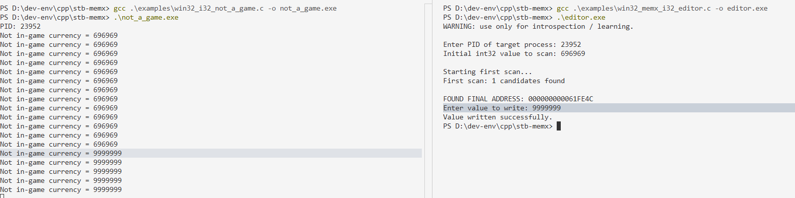

# stb_memx

A single file stb-style header for introspecting, scanning, analyzing and
editing live process memory.

## Why?

Yeah. I am asking you, why would you want to use a tool like this instead of a
debugger?

Exactly.

## Goals

This is not a CE replacement whatsoever.

## Limitations

- Programs running on virtual machines or managed runtimes (addresses move, GC
  happens, life is pain).
- Programs using encrypted memory, anti-tamper mechanisms, or integrity checks.

## Usage

Currently, it allows i8, u8, i32, u32, f32, f64, and raw data blob analysis.

Refer to the examples.

```c
MemxProcess *memx_open_process(uint32_t pid);
void memx_close_process(MemxProcess *p);

MemxScan *memx_scan_begin(MemxProcess *p, MemxType type, const void *value, size_t value_size, MemxComparator cp);
void memx_scan_refine(MemxScan *scan, const void *value, size_t value_size);
size_t memx_scan_count(const MemxScan *scan);
size_t memx_scan_get(const MemxScan *scan, MemxCandidate *out, size_t max);
void memx_scan_free(MemxScan *scan);
int memx_write(MemxProcess *p, void *address, const void *value, size_t size);
```


